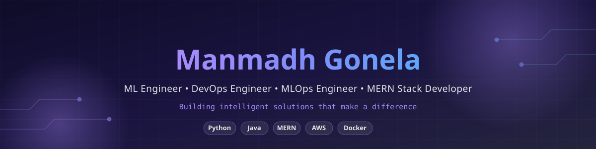

<div align="center">



<br/>

# 👋 Hi, I'm Manmadh Gonela

### 💻 Computer Science Student | SDE | AI/ML | Full-Stack Developer

<p>
Building practical applications with <b>Java, Spring Boot, React, Python, AI/ML and Cloud technologies.</b>
</p>

<br/>

<a href="https://github.com/manmadh55">

</a>
<a href="https://linkedin.com/in/gonela-manmadh">

</a>
<a href="mailto:manmadhgonela@gmail.com">

</a>

<br/><br/>


</div>

---

## 🚀 About Me

I'm a Computer Science student passionate about building **real-world software solutions** and solving problems through technology.

My primary interests include:

* 💻 **Software Development & Backend Engineering**
* ☕ **Java & Spring Boot**
* 🌐 **MERN Stack Development**
* 🤖 **Machine Learning & Artificial Intelligence**
* 🧠 **Generative AI & RAG**
* ☁️ **Cloud & DevOps**
* 🧩 **Data Structures & Algorithms**

I enjoy turning ideas into working applications while continuously improving my problem-solving and engineering skills.

---

## 🛠️ Tech Stack

### 💻 Programming Languages

<p align="center">


</p>

### 🎨 Frontend

<p align="center">


</p>

### ⚙️ Backend

<p align="center">


</p>

### 🤖 AI / Machine Learning

<p align="center">


</p>

### 🗄️ Databases

<p align="center">


</p>

### ☁️ Cloud & DevOps

<p align="center">


</p>

### 🔧 Tools

<p align="center">


</p>

---

## 🔥 Featured Projects

<table>
<tr>

<td width="50%" valign="top">

<h3>❤️ Heart Risk Analyzer</h3>

<p>
An ML-based heart disease risk prediction application with
<strong>model explainability using SHAP</strong>.
</p>

<b>Tech Stack</b>

<br/><br/>

`Python` `Scikit-learn` `Streamlit` `SHAP`

<br/><br/>

<a href="https://github.com/manmadh55/Heart_Risk_Analyzer">
🔗 <b>View Repository</b>
</a>

</td>

<td width="50%" valign="top">

<h3>🧠 MindCare AI</h3>

<p>
An AI-powered mental wellness platform featuring an intelligent
assistant and a modern web interface.
</p>

<b>Tech Stack</b>

<br/><br/>

`React` `MongoDB` `Gemini API`

<br/><br/>

<a href="https://github.com/manmadh55">
🔗 <b>View Repository</b>
</a>

</td>

</tr>

<tr>

<td width="50%" valign="top">

<h3>💼 Career Re-Entry Hub</h3>

<p>
An AI-powered platform designed to help professionals returning
to the workforce discover career opportunities and recommendations.
</p>

<b>Tech Stack</b>

<br/><br/>

`React` `Node.js` `MongoDB`

<br/><br/>

<a href="https://github.com/manmadh55">
🔗 <b>View Repository</b>
</a>

</td>

<td width="50%" valign="top">

<h3>🚀 More Projects</h3>

<p>
I'm continuously building projects across
<strong>Software Development, AI/ML and Full-Stack Development.</strong>
</p>

<br/>

<a href="https://github.com/manmadh55?tab=repositories">
🔗 <b>Explore All Repositories →</b>
</a>

</td>

</tr>
</table>

---

## 📚 Currently Learning

```text
Data Structures & Algorithms
        ↓
Java & Spring Boot
        ↓
Backend Development
        ↓
System Design
        ↓
Advanced Machine Learning
        ↓
Generative AI & RAG
        ↓
Docker & Cloud
```

I'm currently focused on strengthening my **DSA, backend engineering and system design fundamentals** while continuing to explore AI/ML and Generative AI.

---

## 🎯 Career Interests

I'm interested in opportunities related to:

| Area                      | Focus                             |
| ------------------------- | --------------------------------- |
| 💻 Software Engineering   | Java • Spring Boot • Backend      |
| 🌐 Full-Stack Development | React • Node.js • MongoDB         |
| 🤖 AI / ML                | Machine Learning • Explainable AI |
| 🧠 Generative AI          | LLMs • RAG • AI Applications      |
| ☁️ Cloud & DevOps         | AWS • Docker • CI/CD              |

---

---

## 🐍 Contribution Activity

<div align="center">


</div>

---

## 💡 What I Believe

> **Build. Learn. Break. Improve. Repeat.**

I believe the best way to learn software engineering is by **building real projects, solving problems, and continuously improving.**

---

## 🤝 Let's Connect

<div align="center">

I'm always open to connecting with developers, recruiters, and people working on interesting technology.

<br/><br/>

<a href="https://github.com/manmadh55">

</a>

<a href="https://linkedin.com/in/gonela-manmadh">

</a>

<a href="mailto:manmadhgonela@gmail.com">

</a>

<br/><br/>

### ⭐ If you find my projects interesting, consider giving them a star!

</div>

---

<div align="center">

### 💻 Keep Building. Keep Learning. Keep Growing. 🚀

</div>
